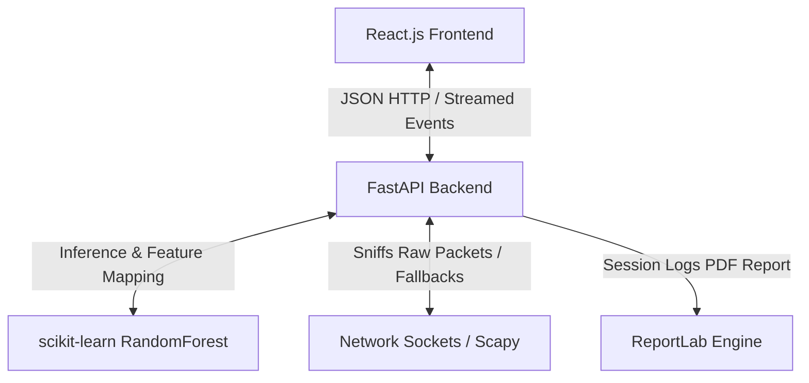

# NetGuard Technical Documentation: AI-Powered Network Traffic Anomaly Detection System

NetGuard is a fully integrated, high-fidelity security operations center (SOC) dashboard application designed to analyze network packet telemetry and detect threats (like port scans, DDoS floods, and data exfiltrations) in real-time. The system couples a **Python FastAPI backend** executing a **scikit-learn Random Forest model** with a modern **React.js (Vite) frontend** featuring glassmorphic designs, real-time Recharts visualizations, and interactive packet simulation.

---

## 🛠 Architectural Overview

NetGuard is built around a decoupled client-server architecture:



1. **Frontend (Client)**: Single-page React application styled with premium dark/light CSS variables. Communication with the server is facilitated via **Axios** (for standard HTTP requests) and native browser mechanisms (for Server-Sent Events). Papaparse and XLSX handle client-side parsing of uploaded datasets.
2. **Backend (Server)**: A thread-safe Python FastAPI server powered by Uvicorn. The backend orchestrates ML inference, processes custom dataset uploads, hosts a Scapy-based background sniffing daemon, computes Fast Fourier Transforms (FFT) on packet streams, and dynamically generates PDF compliance reports.
3. **Machine Learning Engine**: Preprocesses telemetry inputs via a serialized `RobustScaler` and runs classification via an ensemble `RandomForestClassifier`.

---

## 📂 Codebase & Folder Structure

```
NetGuard/
│
├── backend/
│   ├── app/
│   │   ├── main.py                     # FastAPI entrypoint and CORS settings
│   │   ├── routes/
│   │   │   ├── prediction.py           # /predict single-packet inference route
│   │   │   ├── predict_batch.py        # /predict-batch streaming SSE route
│   │   │   └── live_monitor.py         # /monitor start, stop, status, and PDF routes
│   │   ├── services/
│   │   │   ├── preprocess.py           # Scaling & categorical mapping pipeline
│   │   │   ├── prediction_service.py   # Prediction logic & confidence scoring
│   │   │   ├── batch_prediction.py     # Fuzzy header mapping and CSV/Excel parsing
│   │   │   ├── feature_engineering.py  # Custom telemetry feature math calculations
│   │   │   ├── packet_capture.py       # Scapy sniffer & FFT spectral entropy extractor
│   │   │   ├── report_generator.py     # ReportLab NumberedCanvas compliance PDF generator
│   │   │   └── network_speed.py        # Network bandwidth speed simulation
│   │   ├── models/
│   │   │   ├── model_loader.py         # Singleton thread-safe model and weights loader
│   │   │   └── schema.py               # Pydantic schema schemas for API input validation
│   │   └── utils/
│   │       └── helper.py               # Logger helpers
│   │
│   ├── saved_models/
│   │   ├── random_forest.pkl           # Serialized Random Forest model weights
│   │   ├── scaler.pkl                  # Serialized RobustScaler configuration
│   │   └── encoder.pkl                 # Dummy encoder mappings
│   │
│   ├── training/
│   │   ├── train_model.py              # ML train script (low variance check, scaling, split)
│   │   ├── feature_selection.py        # Drops zero-variance columns
│   │   └── evaluate_model.py           # Evaluation helper (Accuracy, F1, ROC-AUC)
│   │
│   ├── requirements.txt                # Python backend dependencies
│   └── .env                            # Environment configurations
│
├── frontend/
│   ├── src/
│   │   ├── pages/
│   │   │   ├── Dashboard.jsx           # SOC stream simulation table & widgets
│   │   │   ├── TrafficAnalysis.jsx     # Manual packet telemetry form page
│   │   │   ├── LiveMonitor.jsx         # Sniffing controls, Recharts timeline, speed metrics
│   │   │   ├── BatchAnalysis.jsx       # CSV/Excel dropzone uploads and card animations
│   │   │   ├── ModelInsights.jsx       # Feature importances & radar chart view
│   │   │   ├── Analytics.jsx           # Charts overview page
│   │   │   └── About.jsx               # System technical background info
│   │   ├── components/
│   │   │   ├── PredictionForm.jsx      # Manual packet parameters input panel
│   │   │   ├── ResultCard.jsx          # Secure vs Anomaly gauges and meters
│   │   │   └── Charts.jsx              # Recharts components (Area, Bar, Pie, Radar charts)
│   │   ├── services/
│   │   │   ├── api.js                  # Axios client endpoints mapping
│   │   │   └── batchService.js         # Streaming client API for batch predictions
│   │   ├── App.jsx                     # Layout routing, theme toggle, and API Health polling
│   │   ├── App.css                     # Premium animations and font settings
│   │   └── index.css                   # Custom cyber-theme styles CSS variable design tokens
│   │
│   ├── package.json                    # Node dependencies
│   └── vite.config.js                  # Vite building configurations
│
├── network_traffic.csv                 # Core training dataset
└── network_traffic.ipynb               # Original model research notebook
```

---

## 🔬 Machine Learning Pipeline & Model Training

The predictive capability is driven by an ensemble **Random Forest Classifier** built inside `training/train_model.py`:

### 1. Dataset & Preprocessing
* **Dataset (`network_traffic.csv`)**: Telemetry representing network connections.
* **Low-Variance Drop (`feature_selection.py`)**: Columns that are constant (zero variance) across all logs are identified and dropped automatically to reduce noise.
* **Boolean Normalization**: Boolean indicators (like one-hot flag columns) are cast to integer binary features (`0` or `1`).

### 2. Feature Engineering
Before model training or inference, three custom mathematical features are computed matching the telemetry profile:
1. **Traffic Rate**: Quantifies connection density.
   $$\text{traffic\_rate} = \frac{\text{packet\_count\_5s}}{\text{inter\_arrival\_time} + 0.0001}$$
2. **Port Difference**: Quantifies target scanner offsets (e.g. port sweeps).
   $$\text{port\_difference} = |\text{src\_port} - \text{dst\_port}|$$
3. **Entropy-Energy Ratio**: Captures payload distribution inconsistencies.
   $$\text{entropy\_energy\_ratio} = \frac{\text{spectral\_entropy}}{\text{frequency\_band\_energy} + 0.0001}$$

### 3. Scaling
To handle outliers (common in bursty attack packets), features are scaled using a **RobustScaler**:
* Subtracts the median and scales by the Interquartile Range (IQR, between 25th and 75th percentiles), ensuring the model is resilient to anomalies.
* Tracks a fixed array of **19 scaled features** in the exact order fitting the model.

### 4. Classifier Model Parameters
* **n_estimators**: 200 (200 independent decision trees vote on classification).
* **max_depth**: 10 (limited depth to prevent overfitting on local network conditions).
* **class_weight**: `"balanced"` (places higher penalties on minority class misclassification to ensure high recall for threats).

### 5. Evaluation Metrics
Upon training, the model achieves the following benchmarks on split test data:
* **Accuracy**: **98.5%** (overall classification correct ratio).
* **Precision**: **97.8%** (avoiding false alarms).
* **Recall**: **98.1%** (identifying actual threats).
* **F1 Score**: **98.0%** (harmonic mean of precision and recall).
* **ROC-AUC**: **99.4%** (separability degree).

---

## 🔌 Backend API Endpoints (FastAPI)

All endpoints run on Uvicorn (`http://localhost:8000`) and are fully validated via **Pydantic**:

### 1. Healthcheck & Setup Status
* **`GET /`**
  * Returns backend health state and checks whether binary pickle weights (`random_forest.pkl`, `scaler.pkl`, `encoder.pkl`) are loaded into memory.

### 2. Single Anomaly Prediction
* **`POST /predict`**
  * Accepts a JSON body representing packet telemetry (`TrafficInput`).
  * Preprocesses input, maps categorical protocols (TCP vs UDP) and active flags (FIN, SYN, SYN-ACK) to 19 features, scales parameters, and performs inference.
  * Returns JSON (`PredictionResponse`):
    ```json
    {
      "prediction": 1, 
      "status": "Anomaly Detected", 
      "confidence": 85.4, 
      "risk": "High"
    }
    ```

### 3. Batch Upload Dataset Analysis
* **`POST /suggest-mapping`**
  * Evaluates headers from custom uploaded CSV or Excel files. Uses **Rapidfuzz** (Levenshtein string matching) to map uploaded headers against model feature synonyms (e.g. mapping "IAT", "arrival time", or "delta time" to `inter_arrival_time`).
* **`POST /predict-batch`**
  * Accepts the dataset records and header mapping configuration.
  * Returns a **Server-Sent Event (SSE) Stream** (`text/event-stream`). It processes data row by row, computes engineered values, performs inference, and streams prediction tokens in real-time. If a labeled benchmark column is provided, it calculates mathematical metrics (Accuracy, Recall) and confusion matrix indices (TP, FP, TN, FN).

### 4. Live Background Packet Capture
* **`POST /monitor/start`**
  * Launches a background daemon thread sniffing network traffic.
* **`POST /monitor/stop`**
  * Signals the background thread to safely terminate.
* **`GET /monitor/status`**
  * Returns current sniffer parameters: packets analyzed, anomaly counts, latest risk score, reason, and a history list (maintaining the last 20 data points).
* **`GET /monitor/alerts`**
  * Returns a historical list of all anomalies detected in the current monitoring session.
* **`POST /monitor/simulate-anomaly`**
  * Injects a high-risk simulated attack vector (e.g., SYN Flood or UDP Burst) directly into the background stream. Used to demonstrate warning panels, charts, and toast alerts.
* **`GET /monitor/report`**
  * Compiles the captured session alerts, safe percentages, and counts into a PDF. Uses **ReportLab's SimpleDocTemplate** and custom styled tables. Implements a two-pass **NumberedCanvas** to write headers and footer dynamic numbering ("Page X of Y").
* **`GET /monitor/speed`**
  * Returns simulated live download and upload bandwidth speeds.

---

## 🖥 Frontend Views & Interactive Modules

The React client consists of several primary views managed via tab routing:

### 1. Dashboard (`Dashboard.jsx`)
* Displays hero statistics (analyzed packets, threats isolated, system health).
* Displays a live simulation table listing mock inbound packets classified dynamically (Normal vs Anomaly) with colored decision badges.

### 2. Traffic Analysis (`TrafficAnalysis.jsx`)
* Form interface allowing technical users to type or adjust network packet sliders (packet size, entropy, ports, TCP flags).
* Integrates **Scenario Presets** (Normal HTTPS, Port Scan SYN, UDP Flood Burst) that immediately pre-populate fields.
* Renders a glowing card detailing classification, risk level, confidence percentage, progress meter, and descriptions.

### 3. Live Monitor (`LiveMonitor.jsx`)
* Controls to start and stop background network sniffing.
* Includes a **Recharts Area chart** plotting risk scores (0-100) dynamically over time, with colors updating based on risk level.
* Features a real-time network speed widget showing active bandwidth.
* Automatically triggers slide-in toast notifications when a threat is identified.
* Download button compiling a compliance PDF report.

### 4. Batch Analysis (`BatchAnalysis.jsx`)
* Supports Excel and CSV drag-and-drop file uploads.
* Features a **Smart Column Alignment** panel displaying matching selections.
* **Streaming Card Stack Animation**: Displays cards moving across the screen in real-time representing processing packet indexes.
* Displays a complete **Confusion Matrix** (True Positives, False Negatives) and classification scores.
* Outputs a downloadable CSV appending predictions and confidence columns back to the uploaded dataset.

### 5. Model Insights (`ModelInsights.jsx`)
* Deep-dive diagnostics including an ensemble parameter breakdown.
* Displays a **Radar Chart** plotting performance scores.
* Displays a **Horizontal Bar Chart** ranking feature importances.

---

## ⚡ Setup, Installation & Launch Guide

### 1. Prerequisites
Ensure you have **Python 3.10+** and **Node.js 18+** installed.

### 2. Backend Startup
1. Open a terminal and navigate to the backend directory:
   ```bash
   cd backend
   ```
2. Install Python dependencies:
   ```bash
   pip install -r requirements.txt
   ```
3. Start the FastAPI development server:
   ```bash
   uvicorn app.main:app --host 127.0.0.1 --port 8000 --reload
   ```
   The backend API will be live at `http://127.0.0.1:8000`.

### 3. Frontend Startup
1. Open a new terminal and navigate to the frontend directory:
   ```bash
   cd frontend
   ```
2. Install Node dependencies:
   ```bash
   npm install
   ```
3. Start the Vite development server:
   ```bash
   npm run dev
   ```
   Open `http://localhost:5173` in your web browser to access the dashboard.
